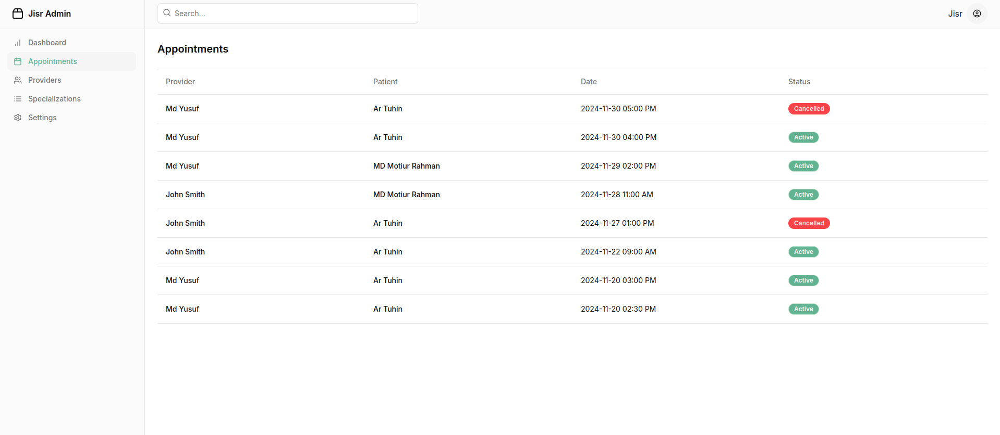

### **Appointments Section**  

The **Appointments Section** provides a detailed list of all appointments scheduled on the JISR platform. This section is presented in a tabular format, allowing the admin to efficiently manage and monitor appointments between healthcare providers and patients.  

The table includes the following key columns:  

| **Column**        | **Description**                                                                                   |  
|--------------------|---------------------------------------------------------------------------------------------------|  
| **Provider**       | Displays the name of the healthcare professional (e.g., doctor, dietitian, psychologist).         |  
| **Patient**        | Shows the name of the patient who booked the appointment.                                         |  
| **Date**           | Indicates the scheduled date and time of the appointment.                                         |  
| **Status**         | Shows the current status of the appointment:  
                      - **Active**: Indicates that the appointment is confirmed and scheduled to take place.  
                      - **Cancelled**: Indicates that the appointment has been canceled by the patient or provider.      |  

This section provides a centralized way for the admin to monitor and manage all appointments, ensuring that the platform runs smoothly and that any issues with scheduling or cancellations are addressed promptly.