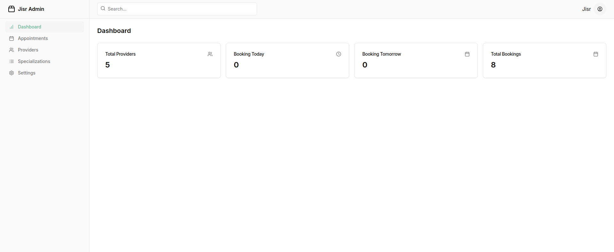

### This is the basic view of admin panel

### **Admin Dashboard Overview**  

The **Admin Dashboard** provides a comprehensive overview of the platform's key metrics, enabling administrators to monitor and manage JISR effectively. It serves as a central hub for accessing essential insights, ensuring the smooth operation of the platform.  

On the dashboard, administrators can view real-time data on various activities and metrics, including the following:  

1. **Total Providers**  
   - Displays the total number of healthcare professionals registered on the platform.  
   - Includes a breakdown of active and inactive providers, allowing the admin to monitor the platform's capacity to meet patient needs.  
   - Provides quick access to the list of providers for management and approval actions.  

2. **Bookings Today**  
   - Shows the total number of bookings scheduled for the current day.  
   - Includes information about the type of bookings (e.g., consultations, diet plans, therapy sessions).  
   - Helps admins track daily activity and identify any issues that require immediate attention.  

3. **Bookings Tomorrow**  
   - Displays the total number of bookings scheduled for the following day.  
   - Allows the admin to anticipate platform activity and ensure the availability of healthcare professionals.  
   - Helps in identifying potential scheduling conflicts or high-demand periods.  

4. **Total Bookings**  
   - Provides a cumulative count of all bookings made on the platform since its launch.  
   - Includes a breakdown of completed, upcoming, and canceled bookings.  
   - Offers insights into platform usage trends and overall performance.  

The Admin Dashboard’s overview section ensures that administrators can quickly assess the platform's performance and make data-driven decisions to enhance the user experience and operational efficiency.