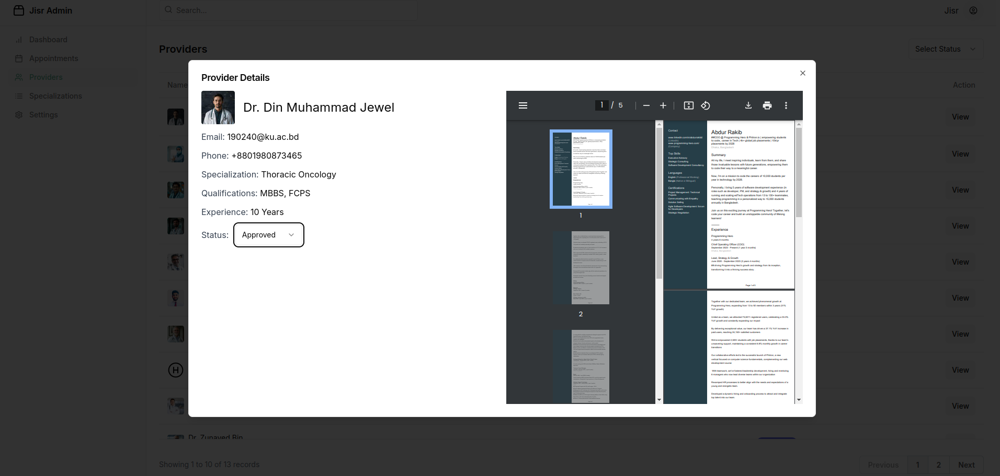

### **Providers Section**  

The **Providers Section** offers a comprehensive table that lists all registered healthcare professionals on the JISR platform. It allows the admin to view, manage, and filter provider details efficiently. This section is essential for maintaining the quality of service by ensuring all providers meet platform standards.  

---

### **Providers Table Structure**  

| **Column**            | **Description**                                                                                 |  
|------------------------|-------------------------------------------------------------------------------------------------|  
| **Name**              | Displays the full name of the provider.                                                         |  
| **Email**             | Shows the provider's email address for communication purposes.                                   |  
| **Phone**             | Displays the provider's contact number.                                                         |  
| **Specialization**    | Indicates the provider's area of expertise (e.g., Oncology, Nutrition, Psychology, etc.).        |  
| **Qualifications**    | Lists the provider's professional qualifications or certifications.                             |  
| **Status**            | Shows the provider's current status:  
   - **Approved**: Provider has been verified and is active on the platform.  
   - **Pending**: Provider’s application is awaiting admin review.  
   - **Rejected**: Provider’s application did not meet the platform’s requirements.                                         |  
| **Action**            | Includes a button or link to view the provider’s full profile with detailed information.         |  

---

### **Filter Section**  

The **Filter Section** allows admins to narrow down the list of providers based on specific criteria for easier management.  

#### **Available Filters**:  
1. **Status Filter**  
   - Filter providers by their current status:  
     - **Approved**  
     - **Pending**  
     - **Rejected**  

2. **Search by Name or Email**  
   - A search bar to find providers by entering their name or email address.  

3. **Specialization Filter**  
   - Allows filtering by a provider’s area of expertise (e.g., Dietitian, Psychologist).  

4. **Qualifications Filter**  
   - Enables searching for providers based on their professional certifications or qualifications.  

---

### **Features of the Providers Section**  

1. **View Full Details**  

   - Clicking the **"View"** button opens a detailed profile of the provider. This profile includes:  
     - Name, contact details, and specialization.  
     - Qualifications and certifications.  
     - Additional documents (e.g., license or certifications uploaded by the provider).  
     - Appointment history and activity on the platform.  

**Like this**

2. **Status Management**  
   - Admins can update a provider’s status directly from the table (e.g., change from "Pending" to "Approved").  

3. **Real-Time Updates**  
   - Changes made by the admin (e.g., approving or rejecting a provider) are immediately reflected in the table.  

4. **Sorting and Pagination**  
   - The table supports sorting by Name, Email, Specialization, or Status.  
   - Pagination ensures efficient handling of a large number of providers.  

---

This **Providers Section** enables administrators to effectively manage the onboarding and performance of healthcare professionals, ensuring that only qualified and verified providers are active on the platform.