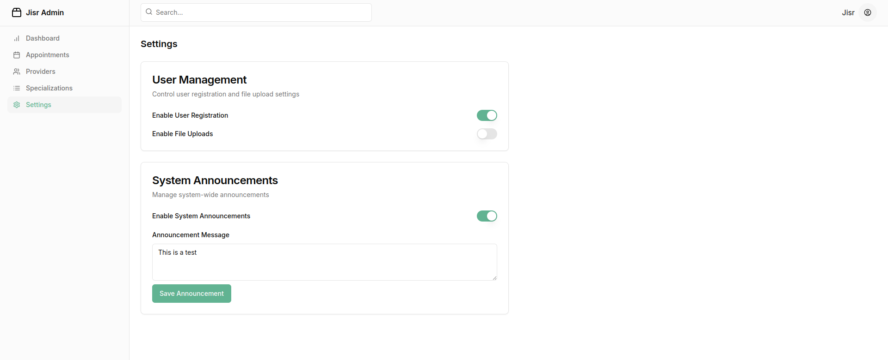

### **Settings Section Overview**

The **Settings Section** allows the admin to configure key aspects of the JISR platform. It is divided into two main categories: **User Management** and **System Announcements**. Each section provides toggles and input fields for easy customization.

---

### **1. User Management**  
This section enables the admin to control user registration and file upload settings.

#### **Features**:
1. **Enable User Registration**  
   - A toggle switch that allows the admin to enable or disable new user registrations on the platform.  
   - When enabled, users can sign up for the platform. When disabled, new registrations are restricted.  

2. **Enable File Uploads**  
   - A toggle switch that enables or disables the file upload functionality for users.  
   - Useful for controlling whether users can upload documents or other files during registration or platform use.

---

### **2. System Announcements**  
This section is used for managing platform-wide announcements.

#### **Features**:
1. **Enable System Announcements**  
   - A toggle switch to activate or deactivate the announcements feature.  
   - When enabled, the announcement message will be displayed to users across the platform.  

2. **Announcement Message**  
   - A text input field where the admin can compose a custom announcement message.  
   - Example: Updates, platform maintenance, or important notices for users.  

3. **Save Announcement**  
   - A button to save the entered announcement message.  
   - Once saved, the announcement is applied immediately to the platform if the feature is enabled.  

---

### **Additional Functionalities**  

1. **Responsive Design**  
   - The settings page is designed to work seamlessly across all devices, ensuring ease of use for admins.

2. **Toggle Feedback**  
   - The toggles provide real-time feedback, visually indicating whether a feature is active or inactive.

3. **User-Friendly Interface**  
   - The clean and minimalistic design ensures that admins can quickly understand and modify platform settings without confusion.

### **How to Logout**  

1. **Click on the Profile Icon**  
   - In the top-right corner of the admin panel, click on the circular **profile icon** (labeled with the admin's username or initials).  

2. **Open the Dropdown Menu**  
   - A dropdown menu will appear, displaying several options related to the user account.  

3. **Select "Logout"**  
   - At the bottom of the dropdown menu, you will see the **"Logout"** option.  
   - Click the **"Logout"** button to securely log out of your account.  

This **Settings Section** simplifies the process of managing core platform configurations, offering the admin complete control over user access and communication tools.