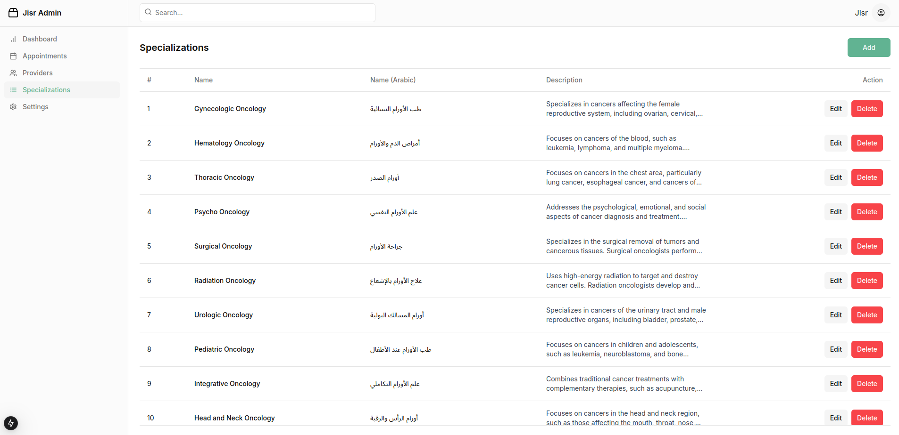
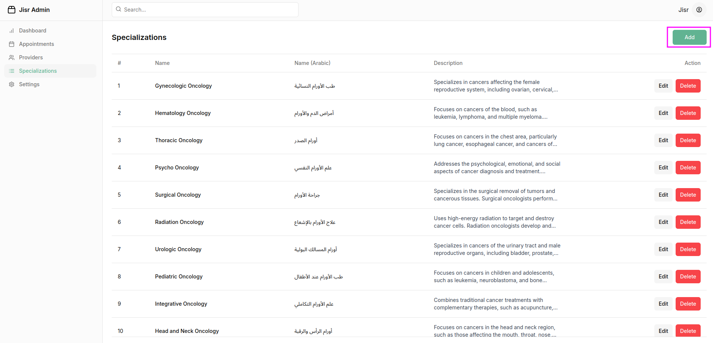
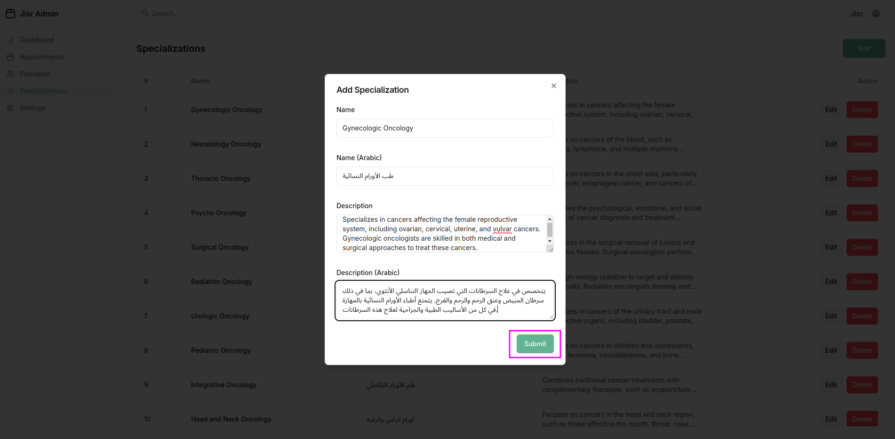

### **Specializations Section**  

The **Specializations Section** provides a clear and organized way for administrators to manage the various areas of expertise available on the JISR platform. This section includes a table that lists all specializations, along with options to edit or delete them. It also provides an intuitive way to add new specializations.  

---

### **Specializations Table Structure**  

| **Column**      | **Description**                                                                                   |  
|------------------|---------------------------------------------------------------------------------------------------|  
| **Name**         | Displays the name of the specialization (e.g., Oncology, Nutrition, Psychology, Life Coaching).   |  
| **Description**  | Provides a brief description of the specialization, explaining its scope or purpose.              |  
| **Action**       | Includes options to:  
   - **Edit**: Modify the specialization name or description.  
   - **Delete**: Permanently remove the specialization from the platform.                                              |  

---

### **Add New Specialization**  

- A button labeled **"Add"** is located in the **top-right corner** of the page.  
- When clicked, it opens a modal or a dedicated form where the admin can input:  
  - **Specialization Name** (required)  
  - **Description** (optional)  
**Like this**

---

### **Features of the Specializations Section**  

1. **Add New Specialization**  
   - Admins can quickly add new areas of expertise to expand the range of services offered on the platform.  
   - Validation ensures that no duplicate specialization names are created.  

2. **Edit Specializations**  
   - Allows admins to modify the name or description of an existing specialization.  
   - Ensures flexibility to update or refine details as needed.  

3. **Delete Specializations**  
   - Admins can delete any specialization that is no longer relevant.  
   - Includes a confirmation prompt to avoid accidental deletions.  

4. **Real-Time Updates**  
   - Any changes made (e.g., adding, editing, or deleting specializations) are reflected immediately in the table.  

---

### **User Interface Layout**  

- **Table Display**:  
  A clean, minimalistic table lists all existing specializations, with columns for **Name**, **Description**, and **Action**.  
- **Top-Right Corner Button**:  
  A prominent **"Add"** button is placed at the top-right corner of the page for quick access.  
- **Responsive Design**:  
  The section is fully responsive, ensuring that admins can manage specializations easily on any device.  

---

This **Specializations Section** ensures that the admin can efficiently manage the platform’s areas of expertise, keeping the list updated and relevant to the needs of patients and healthcare providers.