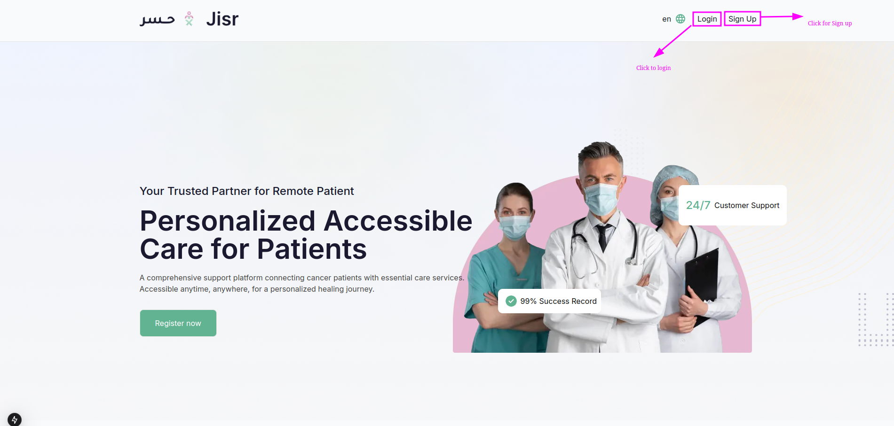
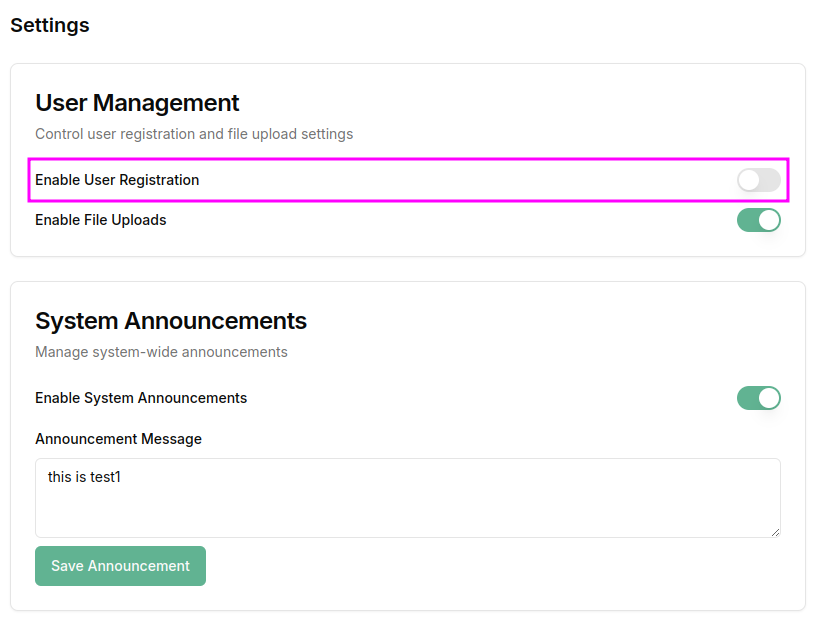
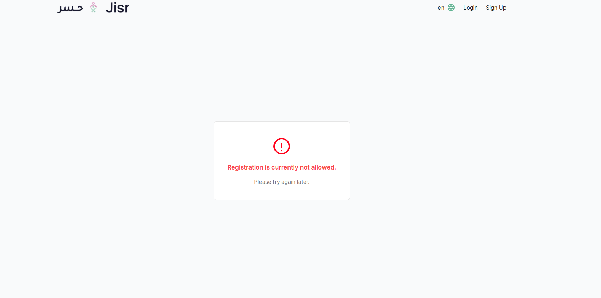
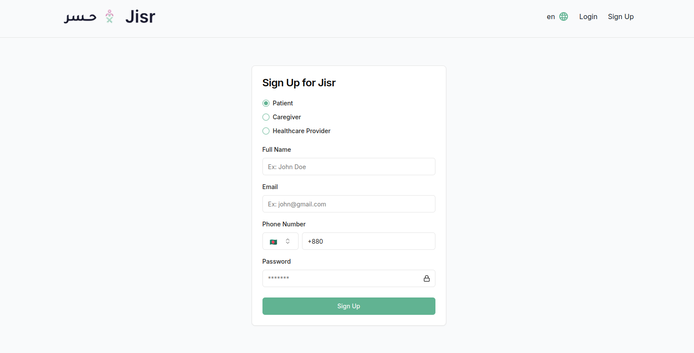
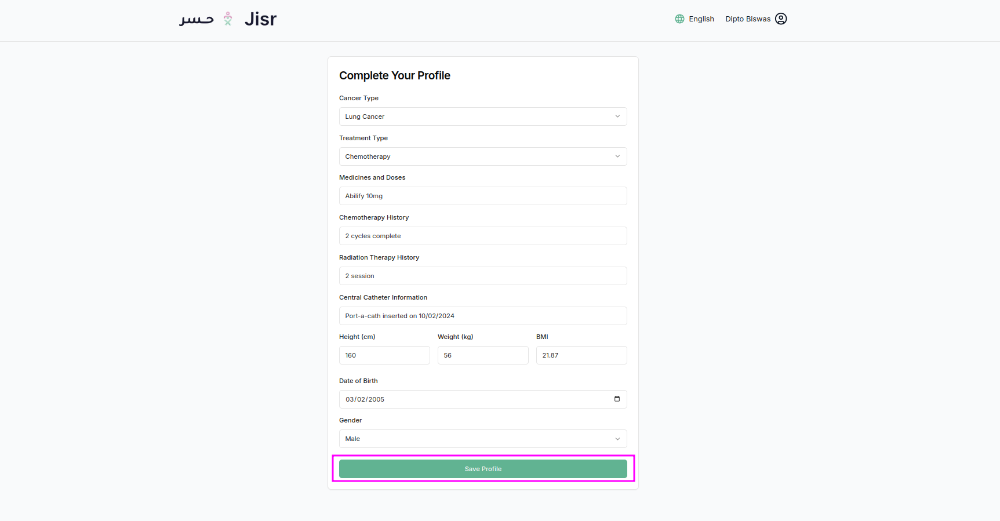
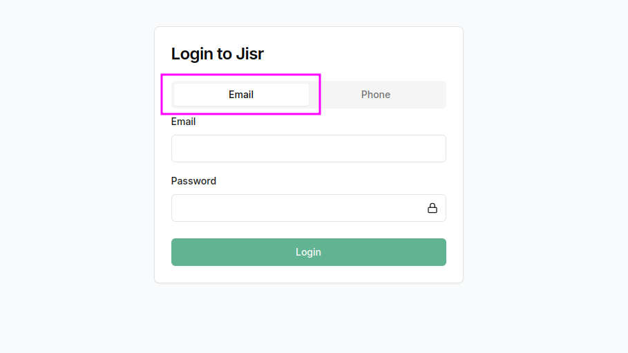
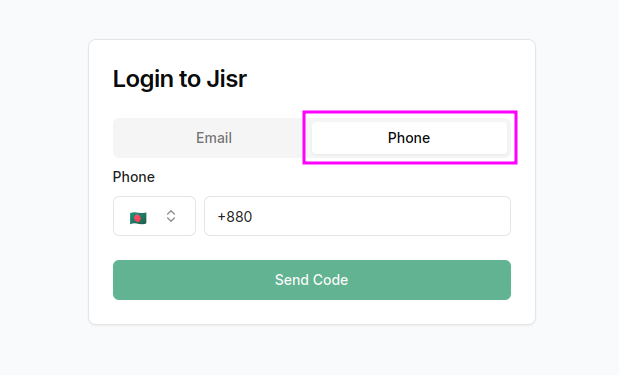

## **User Guide: Login and Sign Up**

#### **Location of Buttons**  
At the top-right corner of the landing page, you will find two buttons:  
- **Login** (on the left)  
- **Sign Up** (on the right)

---

### **Sign-Up Page**

**NOTE**: If user registration disable from admin panel user can't register on this website.

Render this page

If user registration is enabled from the admin panel, clicking the `Sign Up` button will render the sign-up page.

The **Sign-Up page** of the **Jisr** platform allows new users to register by creating an account. This document describes the layout, fields, and functionality of the sign-up process for different user roles, including **Patient**, **Caregiver**, and **Healthcare Provider**.

---

### **Page Elements**

1. **Sign-Up Form**  
   The core feature of this page is the sign-up form, which includes the following fields:
   - **User Role Selection**: 
     - **Patient**
     - **Caregiver**
     - **Healthcare Provider**
   - This allows the user to choose the role for which they wish to register.
   - **Full Name**: A field where users enter their full name (e.g., John Doe).
   - **Email Address**: A field for the user to input their email address (e.g., john@example.com).
   - **Phone Number**: A field for entering the phone number. There is also a dropdown to select the country code.
   - **Password**: A field to create a password for the account. The password should meet security standards (e.g., at least 8 characters).
   - **Sign Up Button**: A button that submits the form and creates the user account.

---

### **Form Fields and Validation**

1. **Role Selection**  
   - Users must choose one of the following roles:
     - **Patient**  
     - **Caregiver**  
     - **Healthcare Provider**

2. **Full Name**  
   - The full name of the user (e.g., John Doe).
   - Validation: The field is required and must not be empty.

3. **Email**  
   - The user must enter a valid email address (e.g., john@example.com).
   - Validation: The system checks if the email format is valid and ensures it is not already registered.

4. **Phone Number**  
   - A field for entering a phone number, with a dropdown to select the appropriate country code (e.g., +880 for Bangladesh).
   - Validation: The phone number should be in the correct format, and the country code should be selected.

5. **Password**  
   - The user must create a password that is strong enough for security purposes (e.g., at least 8 characters).
   - Validation: The password field must not be empty and must meet basic security requirements (e.g., at least one special character, one number).

6. **Sign Up Button**  
   - Clicking this button submits the form and attempts to create a user account.

---

### **Error Handling**

If any field is left empty or incorrect, an error message will be shown:
- **Invalid Email**: If the email format is incorrect or already exists.
- **Required Field**: If any required fields (Full Name, Email, Phone Number, or Password) are left empty.

---

### **Post-Sign-Up Behavior**
After successfully completing the `sign-up` redirect to profile update page . Patient have to update her/his profile after update it will redirect to dashboard.

- **Redirect to dashboard**: Users are redirected to their respective dashboard based on their selected role (Patient, Caregiver, or Healthcare Provider).
---

### **Security Features**

- **Email Validation**: The system validates the email format and checks for any existing accounts associated with the email.
- **Password Hashing**: Passwords are securely hashed before being stored in the database.
---

### **Responsive Design**

- The sign-up page is designed to be fully responsive:
  - On **mobile devices**, the form is adjusted for smaller screens, ensuring an easy experience for users with touch input.
  - On **desktop screens**, the form is centered and has wider fields for ease of use.

---

### **Example Layout**

#### Sign-Up Form:

| **Field**             | **Description**                                                                 |
|-----------------------|---------------------------------------------------------------------------------|
| **Role Selection**     | Choose between **Patient**, **Caregiver**, or **Healthcare Provider**.          |
| **Full Name**          | Enter your full name (e.g., John Doe).                                          |
| **Email Address**      | Enter your email address (e.g., john@example.com).                              |
| **Phone Number**       | Enter your phone number, select the country code (e.g., +880 for Bangladesh).   |
| **Password**           | Enter a password (e.g., at least 8 characters).                                 |
| **Sign Up Button**     | Click to submit the form and create an account.                                 |

---

### **Conclusion**

This **Sign-Up page** allows users to quickly create an account on the **Jisr** platform, with specific options for selecting a user role and entering the required details. The form ensures a smooth and secure registration process, with clear error messages and responsive design for different devices.

### **Login Options Explanation:**

In your application, you have provided two distinct login methods for users, offering flexibility in how they can access the platform. Here's an explanation of the two login options:

---

### **1. By Email (Email with Password)**

#### **How It Works:**
- **Email and Password**: This is the traditional login method where users enter their **email address** and **password** to access their account.
  
#### **Steps:**
1. **Enter Email**: The user types in their registered email address.
2. **Enter Password**: The user provides the password associated with the email.
3. **Login**: After submission, the system verifies the email and password combination.
   - If the credentials match, the user is logged in.
   - If incorrect, an error message is displayed.

#### **Advantages:**
- **Common & Secure**: This is the most common login method for most users. It provides a good level of security and is easy to understand.
- **Standard Process**: Most users are familiar with this method, so it doesn't require additional setup or training.

---

### **2. By Phone (Phone Number with OTP)**

#### **How It Works:**
- **Phone Number and OTP (One-Time Password)**: This login option is based on the user's phone number. Instead of using a password, the user enters their phone number and receives an **OTP** (a unique code) via SMS. They then input the OTP to log in.

#### **Steps:**
1. **Enter Phone Number**: The user inputs their **phone number** in the designated field.
2. **Receive OTP**: The system sends a **one-time password (OTP)** to the phone number provided.
3. **Enter OTP**: The user enters the OTP they received on their phone.
4. **Login**: If the OTP is correct and valid, the user is logged in.

#### **Advantages:**
- **No Password Required**: This is useful for users who may forget their password or want a simpler way to log in without dealing with passwords.
- **Increased Security**: OTPs are temporary and one-time-use, which makes them more secure than static passwords. If someone steals a user's password, they still can't log in without the OTP.
- **Quick & Easy**: This method can be faster for users since it requires just their phone number and a code.

---

### **Why Offer Both Login Methods?**
- **Email Login**: Some users prefer using emails and passwords because they are familiar with this process and might already use this method for other accounts.
- **Phone Number Login**: This is a good option for users who find it easier to log in with their phone number and OTP, especially in cases where they may forget their password. It can also be useful in regions where email usage is less common.

---

In summary:
- **Email login** is for users who prefer a traditional login method.
- **Phone login** is for users who prefer a more mobile-centric approach using OTPs, enhancing convenience and security.

