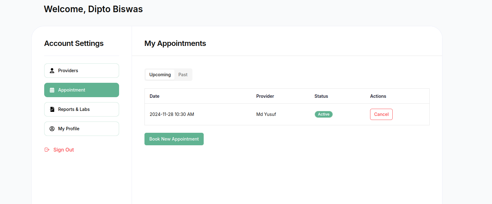
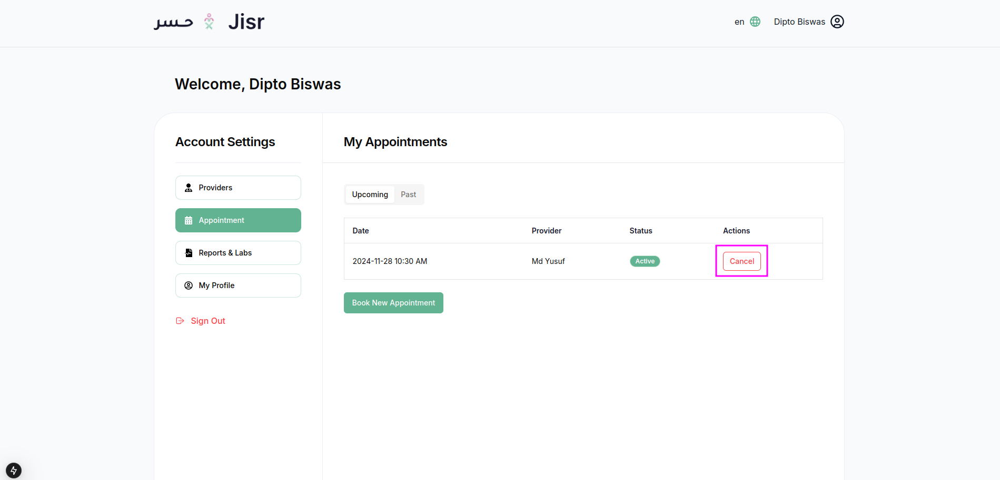
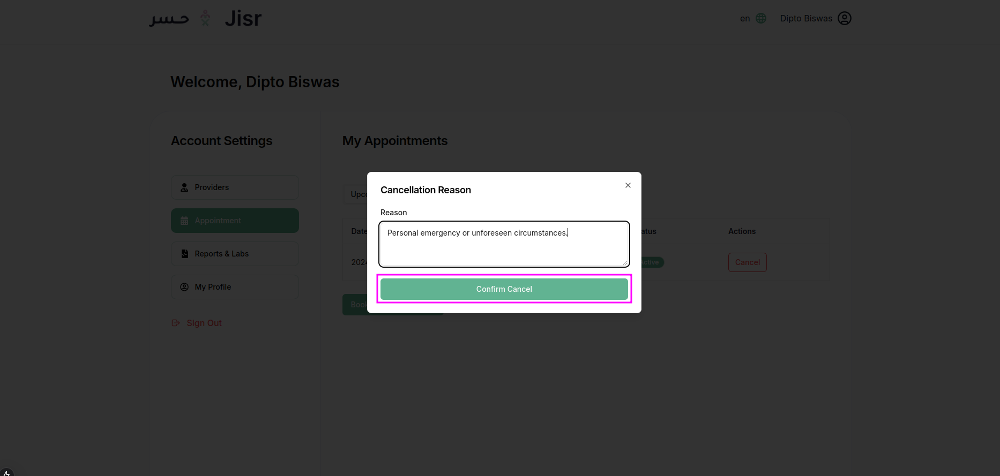

### **Appointment History Section Overview**

The **Appointment History** section provides users with a detailed view of their booked appointments, allowing them to manage and track their healthcare schedule effectively. It includes a comprehensive table, filtering options, and action buttons for better control.

---

### **Key Features of the Appointment History Section**

1. **Appointment Table**  
   The main feature of this section is a table displaying all appointment records with the following columns:  
   - **Date**: The date of the appointment.  
   - **Provider**: The name of the healthcare provider associated with the appointment.  
   - **Status**: Indicates whether the appointment is **Active** or **Canceled**.  
   - **Actions**:  
      - A "Cancel" button allows users to cancel any upcoming appointments if needed.  

2. **Filter Options**  
   - **Past Appointments**: Displays appointments that have already occurred.  
   - **Upcoming Appointments**: Displays future scheduled appointments.  

3. **User-Friendly Controls**  
   - Filters and table data are dynamic and update instantly based on the user’s selection (e.g., showing only upcoming or past appointments).  
   - The status of each appointment (Active or Cancel) is clearly highlighted for easy identification.

4. **Responsive Design**  
   - The layout is optimized for desktop and mobile devices, ensuring a seamless user experience across all platforms.

---

### **Actions Available in the Appointment History Section**

- **Cancel Appointment**:  
   - For active upcoming appointments, users can click the "Cancel" button in the Actions column.  

- If a user wants to cancel an appointment, they must provide a cancellation reason.

---

### **Purpose of the Appointment History Section**

The Appointment History Section allows users to:
- Review and manage all their appointments in one place.  
- Easily distinguish between past and upcoming appointments using filters.  
- Cancel appointments directly if plans change, providing flexibility.  

This section ensures that users have full control over their healthcare schedules with a simple and efficient interface.