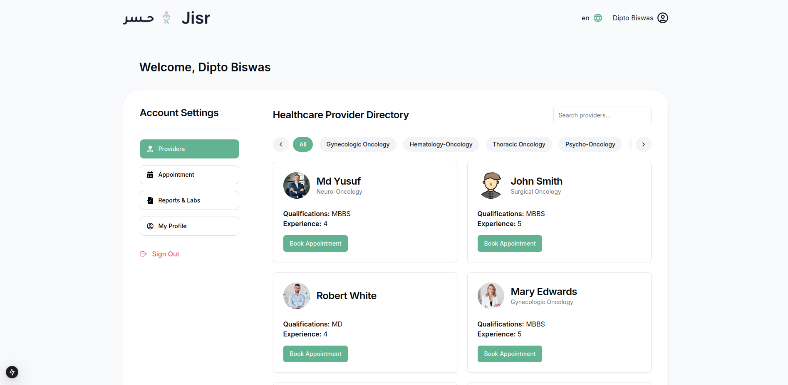

### **Patient Dashboard Overview**

The **Patient Dashboard** is designed to provide an intuitive and user-friendly interface for patients, enabling them to easily access and manage healthcare services on the JISR platform. It is divided into the following key sections:

---

### **1. Welcome Section**
- Displays a personalized greeting for the logged-in user (e.g., "Welcome, Dipto Biswas").
- Includes a **language selector** in the top-right corner for switching between languages.
- The **profile icon** allows access to additional account settings or logout options.

---

### **2. Sidebar Navigation (Account Settings)**  
The sidebar provides quick access to key sections of the platform:
- **Providers**: Displays a directory of available healthcare providers.  
- **Appointment**: Allows users to view and manage their booked appointments.  
- **Reports & Labs**: Provides access to medical reports and laboratory results.  
- **My Profile**: Enables users to view and update their personal information.  
- **Sign Out**: Allows users to securely log out of the platform.

---

### **3. Healthcare Provider Directory**
- The main section of the dashboard displays the **Healthcare Provider Directory**, listing all available providers by specialization.
- **Specialization Filters**:  
   - Users can filter providers based on their specialization (e.g., Gynecologic Oncology, Hematology-Oncology).  
   - A default "All" option shows all providers.  
- **Search Bar**:  
   - Users can search for specific providers by name or specialization using the search field.  

#### **Provider Cards**  
Each provider is displayed in a card format with the following details:  
   - **Name**: Full name of the healthcare provider.  
   - **Specialization**: The provider's area of expertise.  
   - **Qualifications**: Medical qualifications (e.g., MBBS, MD).  
   - **Experience**: Years of professional experience.  
   - **Book Appointment Button**:  
      - A green button that allows users to book an appointment with the provider.

---

### **4. User-Friendly Features**
- **Responsive Design**:  
   - The dashboard is optimized for desktop and mobile devices, ensuring accessibility across all platforms.  
- **Quick Actions**:  
   - Users can easily navigate and perform actions (e.g., booking appointments, updating profiles) in a minimal number of steps.  

---

This dashboard simplifies the patient experience, allowing them to efficiently find providers, book appointments, and manage their medical journey. It ensures both ease of navigation and a comprehensive range of features to address the user's healthcare needs.