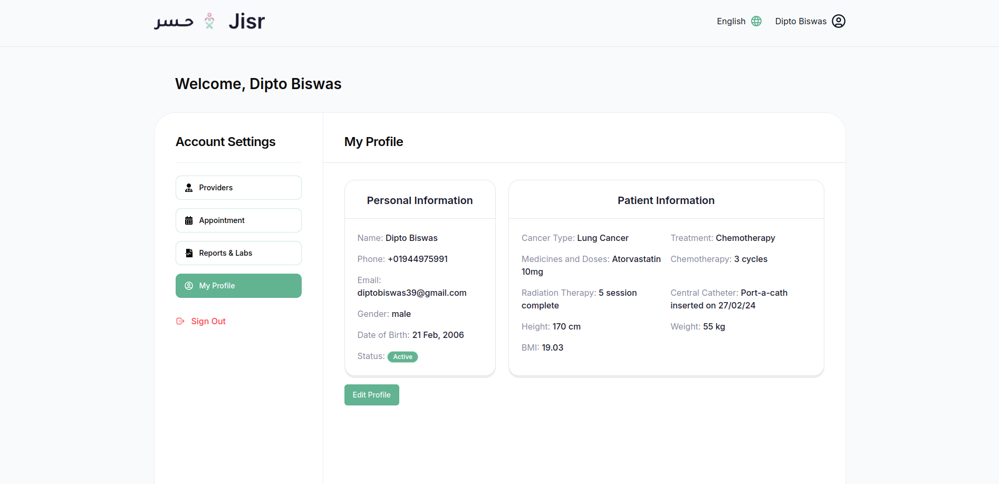
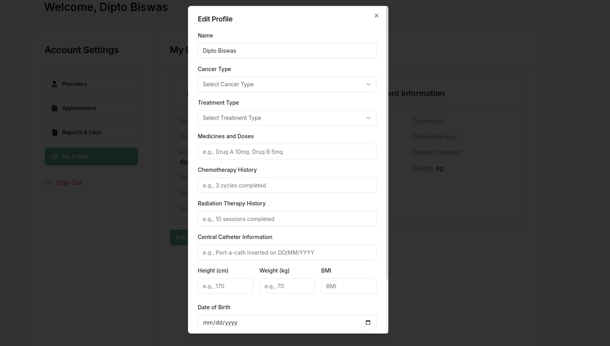

### **Profile Section Overview**

The **Profile Section** is where users can manage and update their personal information and medical details. This section is essential for patients to maintain an up-to-date record of their health condition, treatment plans, and other relevant health metrics. It also allows users to personalize their account and ensure all medical data is accurate for healthcare providers.

---

### **Key Features of the Profile Section**

1. **Personal Information**  
   This section allows users to view and edit their personal details, including:
   - **Full Name**  
   - **Email Address**  
   - **Phone Number**  
   - **Profile Picture** (optional)

2. **Medical Information**  
   Users can enter and update their health-related information, which is crucial for managing their treatment and communicating with healthcare providers:
   - **Cancer Type**: The specific type of cancer the user is diagnosed with.  
   - **Treatment**: The current treatment plan (e.g., surgery, chemotherapy, etc.).  
   - **Medicines and Doses**: List of medicines being taken with their respective dosages.  
   - **Chemotherapy**: Details about chemotherapy treatments (e.g., frequency, sessions).  
   - **Radiation Therapy**: Information about radiation therapy (e.g., scheduled dates, type).  
   - **Central Catheter**: Information on any central catheter placement for medication delivery or monitoring.  
   
3. **Physical Information**  
   Users can track and update their physical health metrics:
   - **Height**: In centimeters (cm).  
   - **Weight**: In kilograms (kg).  
   - **BMI**: The user's body mass index, which can be automatically calculated based on height and weight.  

4. **Edit Personal Information**  
   - Users can click an **Edit Profile** button to modify any section of their profile information.  
   - After editing, the updated information can be saved to the system.

5. **User-Friendly Interface**  
   The profile section is designed for ease of use, with clear fields and input forms for updating information. Fields are categorized (personal, medical, physical) for better organization.

6. **Responsive Design**  
   The profile section is fully responsive, ensuring that users can easily update their information across all devices (desktop, tablet, mobile).

---

### **Actions in the Profile Section**

- **Edit Personal Information**:  
   - Users can click the **Edit Profile** button to update their personal and medical details. After making changes, they can click the **Save** button to update their profile.
   

- **Track BMI**:  
   - The BMI field can be automatically calculated based on the provided **Height** and **Weight**.

---

### **How to Logout**  

 **Click on the Logout Icon**  
   - In the right-bottom corner of the user panel, Click the **"Logout"** button to securely log out of your account.  

### **Purpose of the Profile Section**

The **Profile Section** allows users to:
- Keep their personal and medical information up to date for healthcare providers to view during consultations.  
- Record and manage key health metrics, such as cancer type, treatments, and medications, in one place.  
- Ensure their health history is complete and easily accessible, helping healthcare providers give more accurate and personalized care.

This section helps users stay organized with their healthcare journey and ensures the system is aligned with their medical needs.