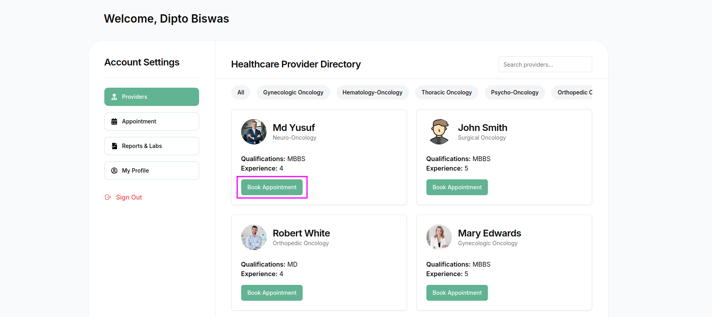
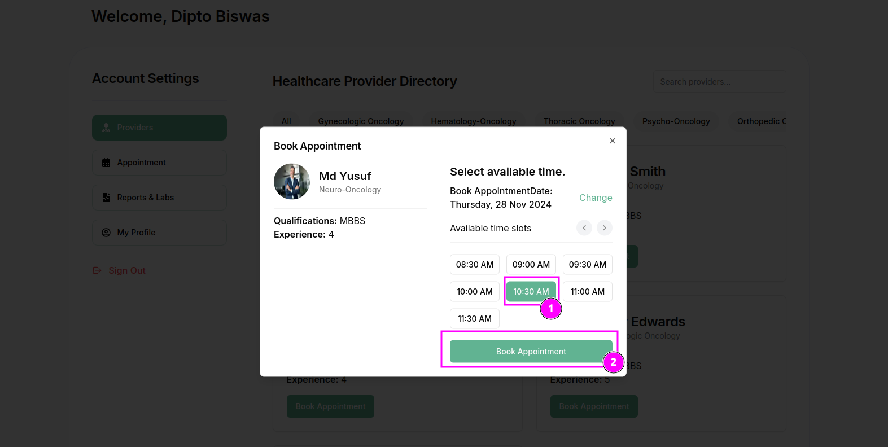

### **Providers Section Overview**

The **Providers Section** in the User Dashboard is a centralized directory that lists all available healthcare providers. It is designed to make it easy for users to find, filter, and book appointments with qualified professionals.

---

### **Key Features of the Providers Section**  

1. **Provider Cards**  
   Each provider is displayed in a card format with the following details:  
   - **Name**: The full name of the provider.  
   - **Specialization**: The provider's medical expertise or field (e.g., Neuro-Oncology, Surgical Oncology).  
   - **Qualifications**: The provider's academic and professional credentials (e.g., MBBS, MD).  
   - **Experience**: The number of years the provider has been practicing.  
   - **Book Appointment Button**:  
      - A prominent green "Book Appointment" button allows users to initiate the appointment booking process for the selected provider.

2. **Search Functionality**  
   - A **search bar** at the top-right corner enables users to search for providers by their name or specialization quickly.

3. **Specialization Filters**  
   - Users can refine their search by selecting a specific **specialization** from the horizontal filter menu.  
   - Categories include:  
      - **Gynecologic Oncology**  
      - **Hematology-Oncology**  
      - **Thoracic Oncology**  
      - **Psycho-Oncology**  
      - **Orthopedic Oncology**, etc.  
   - The default "All" option displays every provider without filtering.

4. **User-Friendly Design**  
   - Clean and structured layout with clear visibility of all provider details.  
   - **Responsive Design** ensures accessibility on all devices (desktop, tablet, and mobile).  

---

### **Actions in the Providers Section**

- **Book an Appointment**  
   - Clicking the **"Book Appointment"** button takes users to the appointment scheduling interface, where they can select the desired time slot.  

- **Detailed Filters**  
   - Users can combine filters and search options to locate specific providers quickly.  

---

### **Purpose of the Providers Section**
The Providers Section empowers users to:
- Access a wide range of healthcare professionals.  
- Quickly identify the right provider based on their needs.  
- Simplify the process of booking appointments.  

This section ensures users have a seamless and effective experience in connecting with qualified healthcare providers.