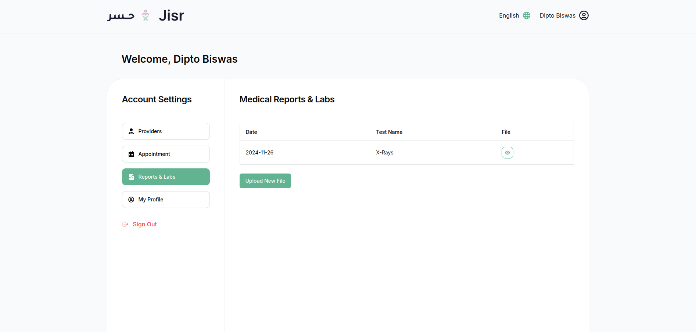
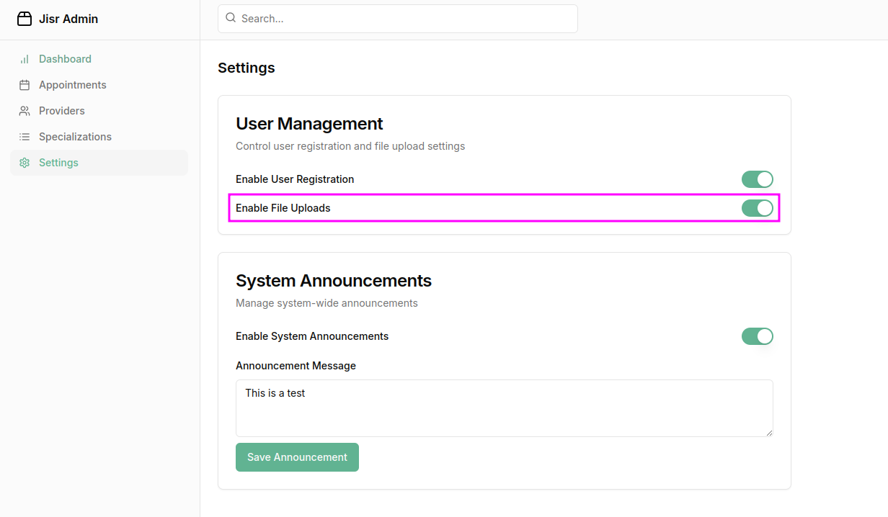

### **Medical Reports & Labs Section Overview**

The **Reports & Labs** section provides users with a centralized location to view, upload, and manage their medical reports and lab results. This feature is essential for patients to keep track of their health records in one place, making it easier to share with healthcare providers during appointments.

---
**NOTE** : 
To ensure that the file upload button only appears when the file upload feature is enabled in the admin panel, you need to conditionally render the button based on the setting in your admin panel.

### **Key Features of the Medical Reports & Labs Section**

1. **Reports Table**  
   The table in this section displays all uploaded medical reports and lab results, with the following columns:  
   - **Date**: The date when the report was uploaded.  
   - **Type**: A description of the report type (e.g., Blood Test, MRI, X-ray, etc.).  
   - **File**: A downloadable link or icon to access the uploaded report or lab result file.  

2. **Upload Medical Reports**  
   - Users can **upload their medical reports** directly from this section by selecting the **upload button**.  
   - The upload feature supports a variety of file formats such as PDF, for different types of reports.  
   - After uploading, the file will be listed in the table with the appropriate **Date**, **Type**, and a link to the file.

3. **User-Friendly Interface**  
   - The interface is simple, making it easy for users to upload and access their reports.  
   - Reports are organized by date and type, allowing users to quickly locate a specific record.  

4. **Secure Storage**  
   - The section ensures secure storage for medical files, protecting sensitive patient data.  

5. **Responsive Design**  
   - The section is designed to be responsive, ensuring users can easily upload and view their medical reports on all devices (desktop, tablet, and mobile).

---

### **Actions in the Medical Reports & Labs Section**

- **Upload Reports**:  
   - Users can click on the **Upload** button to select and upload their medical reports.
  
- **Download Reports**:  
   - Once uploaded, users can click on the **File** link in the table to download and view the report.

---

### **Purpose of the Medical Reports & Labs Section**

The Medical Reports & Labs Section allows users to:
- Keep a digital record of their medical history.  
- Easily upload and access lab results and medical reports for future reference or appointments.  
- Streamline communication with healthcare providers by having all reports in one location.

This section ensures users can manage their health data effectively, maintaining easy access to important medical information.