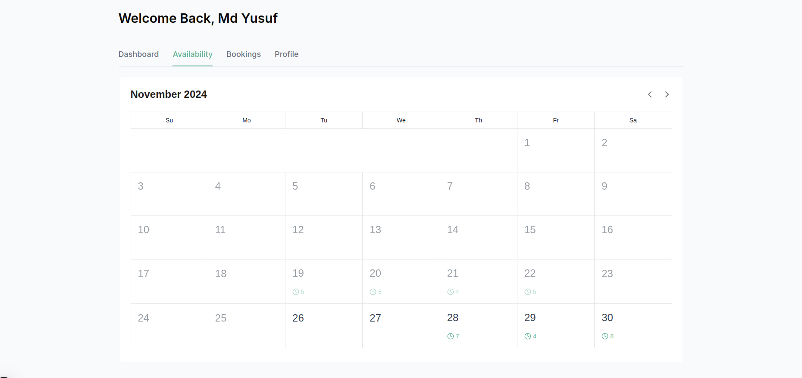
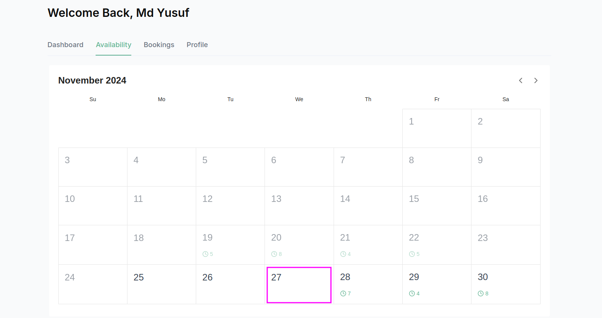
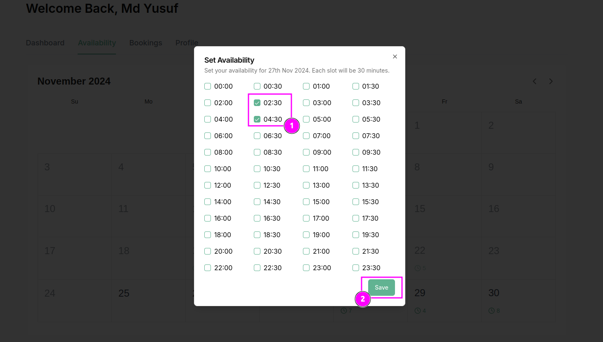

### **Provider Availability Section Overview**

The **Provider Availability Section** is designed to allow healthcare providers to set their availability for appointments. This feature is essential for both the provider and patients to ensure smooth scheduling and avoid conflicts. Providers can define specific days and times when they are available to meet with patients, making it easier for patients to book appointments within the provider’s available time slots.

---

### **Key Features of the Provider Availability Section**

1. **Set Available Days**  
   - Providers can select the days of the week when they are available to see patients (e.g., Monday, Tuesday, etc.).  
   - Each day can have a customized time range for availability, allowing flexibility in scheduling.

2. **Define Available Time Slots**  
   - Providers can set specific time slots (e.g., 9:00 AM – 12:00 PM, 2:00 PM – 5:00 PM).  
   - Multiple time slots can be added within a single day if the provider is available at different times.  
   - Time slots can be adjusted or removed easily by the provider if their schedule changes.

3. **Recurring Availability**  
   - Providers can enable recurring time slots for certain days. For example, if the provider is available every Monday from 9:00 AM to 12:00 PM, they can set this availability to repeat automatically for all upcoming Mondays.  
   - This helps streamline the scheduling process for the provider and reduces the time spent on manually entering availability for each day.

4. **Buffer Times Between Appointments**  
   - Providers can set buffer times (e.g., 15 minutes) between appointments to give themselves time to prepare for the next patient or take a break.  
   - This feature ensures that appointments are scheduled with enough time in between to maintain a manageable workflow.

5. **Unavailable Dates**  
   - Providers can mark certain dates as unavailable (e.g., vacations, holidays, or personal reasons) when they do not want to accept appointments.  
   - These dates will be automatically excluded from the appointment booking system, preventing patients from booking appointments during these times.

6. **Real-Time Updates**  
   - Any changes made to the availability settings are immediately reflected in the system, ensuring that patients can view up-to-date availability when booking an appointment.  
   - Providers can also disable or enable their availability at any time, allowing them to respond quickly to changing schedules.

---

### **User Interface and Actions**

1. **Add Availability Button**  

   - A button or form is available for providers to add new available time slots for specific days. Providers can select a **Hour**, then click **Save** to update their availability.

2. **View Current Availability**  
   - The section can display a weekly or monthly calendar, showing all the available slots set by the provider. This gives a clear view of upcoming availability and allows providers to visually manage their time.

3. **View of Unavailable Dates**  
   - Any dates marked as unavailable will be displayed differently on the calendar, ensuring providers and patients can easily distinguish available and unavailable days.

---

### **Purpose of the Provider Availability Section**

- **Efficient Scheduling**: Ensures that providers have control over their schedule, making it easier to manage appointments.  
- **Patient Convenience**: Patients can only book appointments within the available time slots, eliminating the chance of double-booking or scheduling conflicts.  
- **Flexibility**: Providers can easily update their availability in real-time to adapt to any changes in their schedule, providing greater flexibility.  
- **Better Workflow**: With buffer times and the option to disable certain dates, providers can maintain a more balanced and manageable workload.

This section enhances the booking system's functionality by allowing healthcare providers to manage their time effectively, ensuring they are accessible to patients at their preferred times while also managing their personal and professional needs.