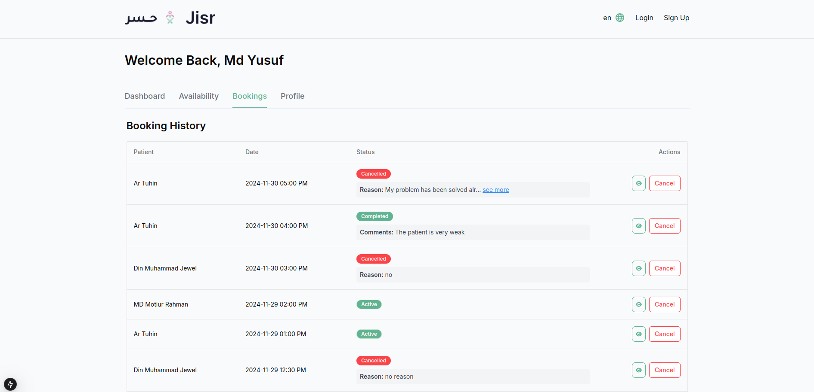

### **Booking History Table Overview**

The **Booking History Table** in the **Provider Panel** displays a log of all past and upcoming bookings for the provider. This section allows providers to manage their patient appointments by reviewing the details of previous bookings, including patient information, appointment dates, and statuses. Providers can also take actions like viewing detailed information about the booking or canceling an upcoming appointment if necessary.

---

### **Booking History Table Structure**

1. **Columns**  
   The table will consist of the following columns:

   - **Patient**: The name of the patient who booked the appointment.  
   - **Date**: The scheduled date of the appointment.  
   - **Status**: The current status of the appointment, which can be:
     - **Active**: The appointment is confirmed and upcoming.
     - **Cancelled**: The appointment has been canceled, either by the provider or the patient.
     - **Completed**: The appointment has been completed.
   - **Actions**: Actions that can be taken on the booking, such as:
     - **View**: Allows the provider to view the details of the booking (e.g., patient info, notes, treatments, etc.).
     - **Cancel**: Allows the provider to cancel the appointment if it is upcoming and not yet completed.

---

### **Key Features**

1. **View Appointment Details**  
   - Providers can click on the **View** action button to see more detailed information about the booking. This could include patient history, the reason for the appointment, special notes, and any associated treatments.
   

2. **Cancel Appointment**  
   - If an appointment is upcoming (not yet completed), providers can cancel it using the **Cancel** button in the **Actions** column. This could be done for various reasons, such as personal unavailability or patient request.
   - Upon cancellation, the status of the appointment will be updated to **Cancelled**, and patients will be notified of the cancellation.

3. **Status Filtering**  
   - The table could include a filter to display appointments based on their status (e.g., Active, Cancelled, Completed). This helps the provider quickly find appointments of a certain status and take action as necessary.

4. **Sorting and Pagination**  
   - The table will likely support sorting by **Date** and **Patient Name**, allowing providers to quickly locate specific appointments.
   - Pagination or infinite scrolling will be used if there are many bookings, helping to prevent the table from becoming too long and difficult to navigate.

5. **Real-Time Updates**  
   - When an appointment is cancelled or marked as completed, the table will be updated in real-time, ensuring that the provider always sees the most current information.

---

### **User Interface Design**

- **Table Header**:  
   The table will have a header with the columns: **Patient**, **Date**, **Status**, and **Actions**.
   
- **Actions Buttons**:  
   The **Actions** column will include buttons such as **View** and **Cancel**, which are clearly distinguishable for easy interaction.

- **Table Row Colors**:  
   - Rows with **Cancelled** appointments can be color-coded (e.g., in red or gray) for easy identification.
   - **Active** appointments might be highlighted in green or blue.
   - **Completed** appointments may appear with a neutral color (e.g., gray or light blue).

---

### **Purpose of the Booking History Table**

- **Appointment Tracking**: It provides a clear overview of all patient appointments, helping the provider stay organized.
- **Easy Management**: Providers can quickly take action on upcoming appointments, such as canceling them or reviewing their details.
- **Enhanced Communication**: By providing easy access to appointment details, this table facilitates better communication with patients, especially in cases of cancellation or rescheduling.
- **Efficient Workflow**: Allows providers to review past and upcoming appointments, ensuring smooth transitions from one patient to another and avoiding scheduling conflicts.

This section contributes to the overall ease of appointment management and enhances the provider's ability to keep track of their patient schedule and appointment statuses.