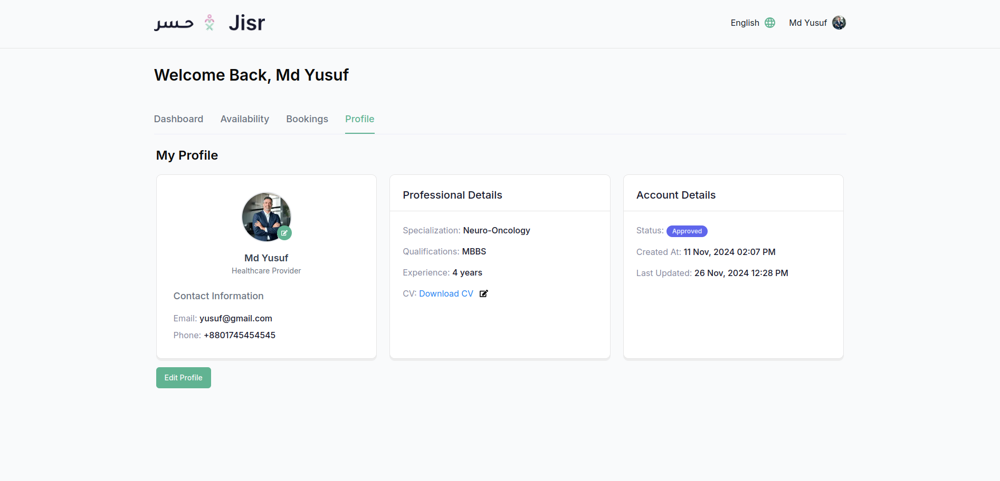
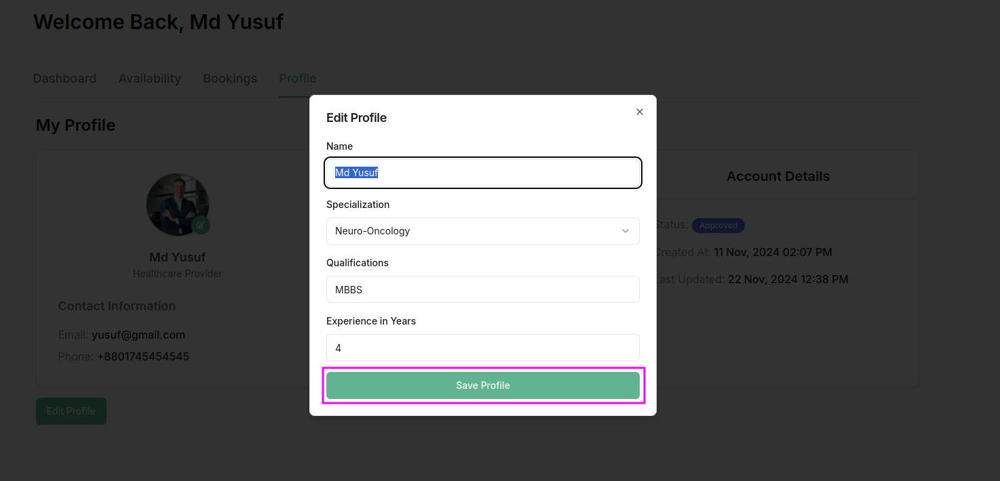

### **Profile Section Overview**

The **Profile Section** is where provider can manage and update their personal information and medical details. This section is essential for patients to maintain an up-to-date record of their health condition, treatment plans, and other relevant health metrics. It also allows provider to personalize their account and ensure all medical data is accurate for healthcare providers.

---

### **Key Features of the Profile Section**

1. **Personal Information**  
   This section allows provider to view and edit their personal details, including:
   - **Full Name**  
   - **Email Address**  
   - **Phone Number**  
   - **Profile Picture** (optional) 

2. **Edit Personal Information**  
   - provider can click an **Edit Profile** button to modify any section of their profile information.  
   - After editing, the updated information can be saved to the system.

3. **User-Friendly Interface**  
   The profile section is designed for ease of use, with clear fields and input forms for updating information. Fields are categorized (personal, medical, physical) for better organization.

4. **Responsive Design**  
   The profile section is fully responsive, ensuring that provider can easily update their information across all devices (desktop, tablet, mobile).

---

### **Actions in the Profile Section**

- **Edit Personal Information**:  
   - provider can click the **Edit Profile** button to update their personal and medical details. After making changes, they can click the **Save** button to update their profile.
   

---

### **How to Logout**  

1. **Click on the Profile Icon**  
   - In the top-right corner of the admin panel, click on the circular **profile icon** (labeled with the admin's username or initials).  

2. **Open the Dropdown Menu**  
   - A dropdown menu will appear, displaying several options related to the user account.  

3. **Select "Logout"**  
   - At the bottom of the dropdown menu, you will see the **"Logout"** option.  
   - Click the **"Logout"** button to securely log out of your account.  

### **Purpose of the Profile Section**

The **Profile Section** allows provider to:
- Keep their personal and medical information up to date for healthcare providers to view during consultations.  
- Record and manage key health metrics, such as cancer type, treatments, and medications, in one place.  
- Ensure their health history is complete and easily accessible, helping healthcare providers give more accurate and personalized care.

This section helps provider stay organized with their healthcare journey and ensures the system is aligned with their medical needs.